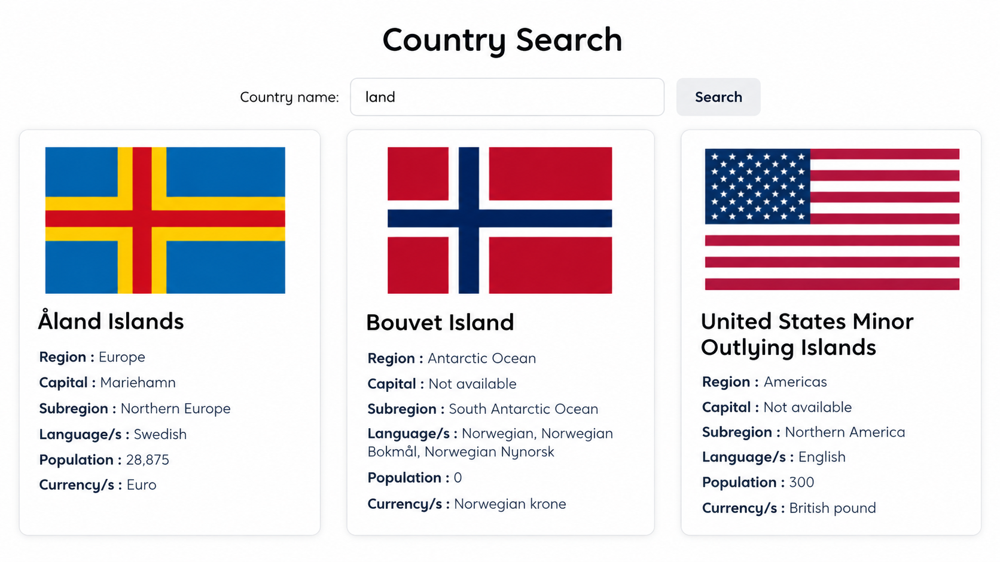

# Country Search Website

A responsive country search website built with HTML, CSS, and JavaScript.

## Live Demo

[View the live website](https://rukia-00.github.io/country-search-website/)

## Features

- Search for countries by name
- Display country flags
- Display region, subregion, and capital
- Display languages
- Display population
- Display currencies
- Loading and error messages
- Responsive design
- Enter key support for searching

## Technologies

- HTML5
- CSS3
- JavaScript
- Fetch API
- REST API
- Git & GitHub
- GitHub Pages

## What I Learned

This project helped me practice:

- Working with APIs using `fetch()`
- Handling JSON data
- Working with promises
- Error handling with `.catch()`
- Working with arrays and objects
- Using `map()` and `join()`
- DOM manipulation
- Responsive web design
- Git and GitHub
- Deploying a website with GitHub Pages
